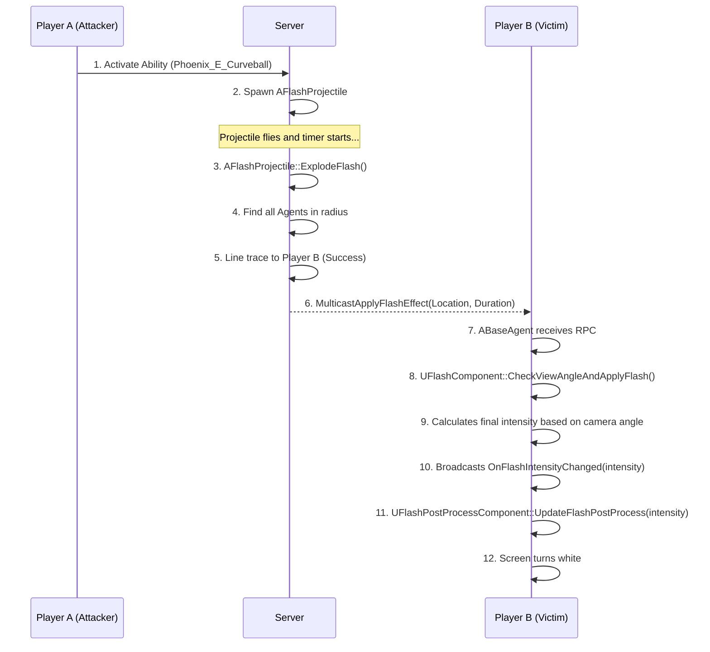

# Flash 시스템

## 1. 설계 목표 및 근거 (Design Goals & Rationale)

Flash(섬광) 시스템은 플레이어의 시야를 방해하는 핵심적인 군중 제어(CC) 기능으로, 설계 시 다음 목표에 중점을 두었습니다.

1.  **정교한 판정 로직**: 단순히 화면을 하얗게 만드는 것을 넘어, 섬광탄과의 거리, 시야각, 그리고 중간 장애물 여부를 모두 계산하여 섬광 효과의 강도와 지속 시간을 다르게 적용하는 것을 목표로 했습니다. 이를 통해 플레이어가 섬광탄에 대처할 수 있는 여지를 만들어 더 깊이 있는 게임플레이를 유도했습니다.

2.  **역할 분리를 통한 확장성**: 섬광 효과를 유발하는 액터(`AFlashProjectile`), 효과의 강도를 계산하는 로직(`UFlashComponent`), 그리고 실제 화면 효과를 렌더링하는 부분(`UFlashPostProcessComponent`)의 역할을 명확히 분리했습니다. 이를 통해, 피닉스의 커브볼처럼 휘어지는 섬광탄이나 케이/오의 직선 섬광탄 등 각기 다른 투사체 로직을 가지는 스킬을 개발할 때, 핵심 판정 로직을 재사용하여 쉽게 확장할 수 있도록 설계했습니다.

3.  **클라이언트 기반 판정의 최적화**: 섬광 효과의 최종 강도를 결정하는 시야각 계산은 각 클라이언트에서 독립적으로 수행하도록 설계했습니다. 서버는 "이 위치에 섬광이 터졌다"는 사실만 모든 클라이언트에게 전파하고, 실제 효과를 받을지는 각 클라이언트가 스스로의 카메라 시점을 기준으로 판단합니다. 이는 서버의 계산 부하를 줄이고, 네트워크 지연으로 인한 판정 오류를 최소화하는 효과적인 방법입니다.

## 2. 아키텍처 (Architecture)

Flash 시스템은 어빌리티가 생성한 `AFlashProjectile`이 폭발하면서 시작되고, 각 플레이어의 Agent에 부착된 컴포넌트들이 연쇄적으로 반응하여 최종 효과를 만들어냅니다.

### 핵심 클래스 및 컴포넌트

*   **`UPhoenix_E_Curveball` (GameplayAbility)**: 플레이어가 스킬을 사용했을 때, 섬광탄 역할을 하는 `AFlashProjectile` 액터를 월드에 스폰시키는 책임을 가집니다.
*   **`AFlashProjectile`**: 섬광탄 액터입니다. 서버에서 폭발(`ExplodeFlash`)하면 자신의 유효 반경 내에 있는 모든 `ABaseAgent`를 찾아 장애물 검사(`LineTrace`)를 수행하고, 통과한 Agent들에게 멀티캐스트 RPC(`MulticastApplyFlashEffect`)를 호출합니다.
*   **`UFlashComponent`**: `ABaseAgent`에 부착됩니다. 멀티캐스트 RPC를 수신하면, 폭발 위치와 자신의 카메라 시야각을 계산하여 최종 섬광 강도(Intensity)와 지속 시간을 결정합니다. 계산된 강도는 `OnFlashIntensityChanged` 델리게이트를 통해 외부에 알립니다.
*   **`UFlashPostProcessComponent`**: `ABaseAgent`에 부착됩니다. `UFlashComponent`의 `OnFlashIntensityChanged` 델리게이트에 자신의 업데이트 함수를 바인딩하고, 전달받은 강도 값에 따라 카메라의 포스트 프로세스 머티리얼 파라미터(밝기, 채도 등)를 실시간으로 조절하여 시각 효과를 렌더링합니다.

### 시퀀스 다이어그램 (Mermaid.js)



## 3. 핵심 로직 분석 (Core Logic)

### 시야각에 따른 섬광 강도 계산

`UFlashComponent`의 `CalculateViewAngleMultiplier` 함수는 이 시스템의 핵심적인 판정 로직을 보여줍니다. 플레이어의 카메라가 섬광 폭발 지점을 얼마나 정면으로 보고 있었는지에 따라 효과의 강도를 차등 적용합니다.

```cpp
// In FlashComponent.cpp
// [GitHub에서 전체 코드 보기](...)

float UFlashComponent::CalculateViewAngleMultiplier(FVector FlashLocation)
{
    APawn* OwnerPawn = Cast<APawn>(GetOwner());
    if (!OwnerPawn || !OwnerPawn->IsLocallyControlled()) return 0.0f;

    AController* Controller = OwnerPawn->GetController();
    if (!Controller) return 0.0f;

    FVector CameraLocation;
    FRotator CameraRotation;
    Controller->GetPlayerViewPoint(CameraLocation, CameraRotation);

    FVector DirectionToFlash = (FlashLocation - CameraLocation).GetSafeNormal();
    FVector ForwardVector = CameraRotation.Vector();

    // 내적(Dot Product)을 사용하여 두 벡터 사이의 각도를 구함
    float DotProduct = FVector::DotProduct(ForwardVector, DirectionToFlash);
    float Angle = FMath::Acos(DotProduct) * (180.0f / PI);

    if (Angle <= FrontViewAngle) // 정면 (e.g., 0-30도)
    {
        return FrontViewMultiplier; // 1.0 (100% 효과)
    }
    if (Angle <= SideViewAngle) // 측면 (e.g., 30-60도)
    {
        return SideViewMultiplier; // 0.7 (70% 효과)
    }
    if (Angle <= ViewAngleThreshold) // 주변부 (e.g., 60-90도)
    {
        return PeripheralViewMultiplier; // 0.4 (40% 효과)
    }

    return 0.0f; // 시야 밖
}
```
*   **의도**: 이 코드는 벡터 내적(Dot Product)이라는 효율적인 연산을 통해 플레이어의 시야각을 정확히 계산합니다. 이를 통해 단순히 '보인다/안 보인다'의 이분법적 판정을 넘어, "얼마나 정면으로 봤는가"에 따라 달라지는 아날로그적인 효과를 구현하여 게임플레이의 깊이를 더했습니다.

## 4. 구현 결과 및 문제 해결 (Implementation & Problem Solving)

### 구현 결과

이 아키텍처를 통해, 플레이어는 섬광탄을 등지거나 시야의 주변부로 피하는 방식으로 섬광 효과를 완화시킬 수 있습니다. 또한 벽 뒤에 숨으면 섬광 효과를 완전히 피할 수 있습니다. 이 모든 판정은 각 클라이언트에서 실시간으로 이루어지며, 매우 정교하게 동작합니다.

<!-- [[영상: 정면, 측면, 후면에서 섬광탄을 맞았을 때 효과가 다르게 적용되는 비교 영상.mp4]] -->

### 기술적 문제 해결: 포스트 프로세스 머티리얼 제어

*   **문제**: 초기 구현 시, 섬광 효과를 위해 포스트 프로세스 볼륨의 설정을 직접 변경하려고 했습니다. 하지만 이 방식은 월드에 이미 배치된 볼륨에만 적용할 수 있었고, 각 플레이어에게 개별적인 강도의 효과를 적용하기가 매우 어려웠습니다.
*   **원인**: 포스트 프로세스 볼륨은 월드 전체나 특정 영역에 영향을 미치는 글로벌한 설정이며, 개별 플레이어의 카메라에 동적으로, 그리고 독립적으로 효과를 적용하기 위한 용도가 아니었습니다.
*   **해결 과정**:
    1.  `UFlashPostProcessComponent`라는 별도의 컴포넌트를 만들어 플레이어의 `CameraComponent`에 직접 접근하도록 했습니다.
    2.  `CameraComponent`는 자체적으로 `PostProcessSettings`라는 속성을 가지고 있으며, 이 값을 변경하면 해당 카메라에만 포스트 프로세스 효과를 적용할 수 있다는 것을 확인했습니다.
    3.  `UFlashPostProcessComponent`가 `UFlashComponent`에서 계산된 `FlashIntensity` 값을 받아, 이 값을 `CameraComponent->PostProcessSettings`의 `ColorGrading`과 `Film` 속성(밝기, 채도 등)에 매핑하여 실시간으로 업데이트하도록 로직을 수정했습니다.
*   **교훈**: 언리얼 엔진의 렌더링 파이프라인에 대한 이해가 중요함을 깨달았습니다. 전역(Global) 설정과 개별(Local) 설정을 구분하고, 원하는 기능에 가장 적합한 컴포넌트와 속성을 찾아 사용하는 것이 효율적이고 확장성 있는 코드를 만드는 핵심이라는 것을 배웠습니다. 포스트 프로세스 볼륨 대신 카메라 컴포넌트의 설정을 직접 제어함으로써, 각 플레이어에게 독립적인 시각 효과를 적용하는 문제를 깔끔하게 해결할 수 있었습니다.

## 5. 관련 시스템 (Related Systems)

*   **[GAS 소개 및 아키텍처](./GAS-Intro.md)**: Flash 스킬 자체는 이 문서에 설명된 GAS 아키텍처 위에서 `GameplayAbility`로 구현됩니다.
*   **[Input 및 HUD와 ASC 연동](./Input-HUD-ASC.md)**: 플레이어가 Flash 스킬을 사용하는 입력 과정은 이 시스템과 직접적으로 연관됩니다.
