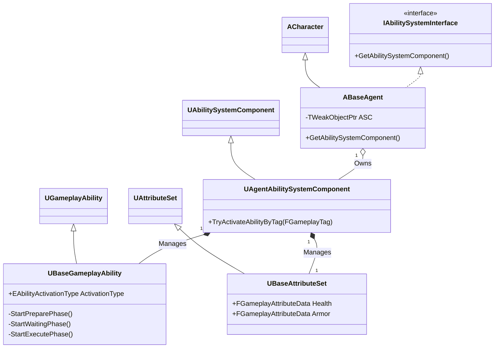

# GAS (Gameplay Ability System) 소개 및 아키텍처

## 1. 설계 목표 및 근거 (Design Goals & Rationale)

이 프로젝트의 스킬 시스템을 GAS(Gameplay Ability System) 기반으로 설계할 때의 핵심 목표는 다음과 같았습니다.

1.  **모듈성 및 재사용성 극대화**: 각기 다른 에이전트의 스킬들을 독립적인 모듈로 개발하여, 새로운 스킬을 추가하거나 기존 스킬을 수정할 때 다른 시스템에 미치는 영향을 최소화하고 싶었습니다. `UBaseGameplayAbility`라는 공통 기반 클래스를 만들어 모든 스킬이 이를 상속받도록 설계했습니다.

2.  **입력과 어빌리티 로직의 분리**: 플레이어의 입력 처리를 실제 어빌리티의 실행 로직과 완전히 분리하여 유연성을 확보하고자 했습니다. 이를 위해 `GameplayTag`를 사용하여 "입력 신호"를 보내면, `AgentAbilitySystemComponent`가 해당 태그를 가진 어빌리티를 찾아 실행하는 방식을 채택했습니다. 덕분에 키 바인딩이 바뀌거나 스킬 구성이 변경되어도 핵심 코드를 수정할 필요가 없습니다.

3.  **복잡한 스킬 상태의 체계적 관리**: 발로란트의 스킬들은 단순한 '즉시 발동' 외에도 '길게 누르기', '준비 후 발사' 등 복잡한 상태를 가집니다. `UBaseGameplayAbility` 내부에 `Preparing`, `Waiting`, `Executing`의 3단계 상태 머신을 구현하여, 이러한 복잡한 스킬 시퀀스를 모든 스킬에서 일관되고 체계적으로 관리할 수 있도록 설계했습니다.

## 2. 아키텍처 (Architecture)

본 프로젝트의 GAS 아키텍처는 언리얼 엔진의 기본 GAS 클래스를 상속받아 프로젝트의 특성에 맞게 확장한 커스텀 클래스들을 중심으로 구성됩니다.

### 핵심 클래스 및 역할

*   **`ABaseAgent`**: 모든 플레이어 캐릭터의 부모 클래스입니다. `IAbilitySystemInterface`를 구현하며, 내부에 `AgentAbilitySystemComponent`와 `BaseAttributeSet`의 인스턴스를 소유하고 초기화하는 역할을 담당합니다.
*   **`UAgentAbilitySystemComponent`**: `UAbilitySystemComponent`를 상속받은 핵심 클래스입니다. 어빌리티 부여, 입력 태그를 통한 어빌리티 활성화(`TryActivateAbilityByTag`), 어빌리티 상태 관리 등 모든 GAS 관련 동작의 중앙 허브 역할을 합니다.
*   **`UBaseGameplayAbility`**: `UGameplayAbility`를 상속받아, 모든 스킬이 공통적으로 사용할 상태 머신(Prepare-Wait-Execute), 애니메이션 재생, 이펙트 출력 등의 기능을 미리 구현해놓은 기반 클래스입니다.
*   **`UBaseAttributeSet`**: `UAttributeSet`을 상속하며, 모든 캐릭터가 공통으로 가질 체력(Health), 방어력(Armor) 등의 속성을 정의합니다. 속성 값의 변경을 감지하고, 변경 시 관련 로직(예: HUD 업데이트)을 처리하는 델리게이트를 포함합니다.

### 클래스 다이어그램 (Mermaid.js)



## 3. 핵심 로직 분석 (Core Logic)

### 어빌리티 상태 머신

모든 스킬의 기반이 되는 `UBaseGameplayAbility`의 `ActivateAbility` 함수는 이 시스템의 핵심 설계 사상을 잘 보여줍니다. 스킬의 `ActivationType`에 따라 즉시 실행할지, 준비 상태를 거칠지 결정합니다.

```cpp
// 실제 GitHub 링크는 여기에 삽입하세요.
// [GitHub에서 전체 코드 보기](...)

void UBaseGameplayAbility::ActivateAbility(/*...*/) 
{
    Super::ActivateAbility(Handle, ActorInfo, ActivationInfo, TriggerEventData);

    if (ActivationType == EAbilityActivationType::Instant) 
    { 
        // 즉시 실행 타입이면 바로 Execute
        StartExecutePhase();
    }
    else 
    { 
        // 준비 타입이면 Prepare 단계부터 시작
        StartPreparePhase();
    }
}
```
*   **의도**: 이 분기 처리를 통해, 각 스킬은 단지 `ActivationType` 열거형 변수 값만 다르게 설정하는 것만으로 복잡한 상태 관리 로직을 그대로 재사용할 수 있습니다. 이는 새로운 스킬을 추가할 때 개발 비용을 크게 절감시킵니다.

## 4. 구현 결과 및 문제 해결 (Implementation & Problem Solving)

### 구현 결과

이 아키텍처를 통해 피닉스의 '불길' 스킬과 같이 여러 단계로 구성된 스킬을 성공적으로 구현했습니다. 플레이어가 스킬 키를 누르면 `UBaseGameplayAbility`의 `Prepare` 상태로 진입하여 조준을 시작하고, 마우스 클릭 시 `Execute` 상태로 넘어가 불길을 발사합니다. 이 모든 과정은 상태 머신에 의해 제어되며, 각 상태에 맞는 애니메이션과 이펙트가 자동으로 재생됩니다.

<!-- [[영상: 피닉스 C 스킬(불길) 사용 영상.mp4]] -->

### 기술적 문제 해결: 어빌리티 상태 충돌

*   **문제**: 개발 초기, 한 스킬을 사용하는 도중에 다른 스킬을 사용하거나, 특정 동작(무기 교체 등)을 할 경우 애니메이션이 꼬이거나 어빌리티가 중간에 멈추는 등 상태 충돌 문제가 빈번했습니다.
*   **원인**: 어빌리티의 현재 상태를 명확하게 정의하고 다른 시스템에서 이를 확인할 방법이 없었기 때문입니다. 각 어빌리티가 독립적으로만 작동하고 서로의 상태를 고려하지 않았습니다.
*   **해결 과정**:
    1.  `UBaseGameplayAbility`의 상태 머신에 진입할 때마다 캐릭터의 ASC에 `State.Ability.Preparing`, `State.Ability.Executing` 등의 `GameplayTag`를 부여하도록 수정했습니다.
    2.  `UBaseGameplayAbility`의 `CanActivateAbility` 함수를 오버라이드하여, 만약 캐릭터가 이미 특정 상태 태그(예: `State.Ability.Executing`)를 가지고 있다면 새로운 어빌리티가 활성화되지 않도록 막았습니다.
    3.  또한, 어빌리티 사용 중에 입력을 막아야 할 경우 `Block.Ability.Input`과 같은 "차단 태그"를 부여하여, 캐릭터가 해당 태그를 가지고 있는 동안에는 입력을 무시하도록 처리했습니다.
*   **교훈**: GAS의 `GameplayTag`는 단순한 식별자를 넘어, 시스템 전역에서 상태를 공유하고 참조할 수 있는 매우 강력한 상태 관리 도구임을 깨달았습니다. 복잡한 상호작용을 제어할 때, boolean 플래그를 남발하기보다 태그 시스템을 적극적으로 활용하는 것이 훨씬 확장성 있고 안정적인 코드를 만드는 비결이라는 것을 배웠습니다.

## 5. 관련 시스템 (Related Systems)

*   **[Input 및 HUD와 ASC 연동](./Input-HUD-ASC.md)**: 이 문서에 설명된 입력 처리 시스템이 GAS 어빌리티를 활성화시키고, HUD는 GAS의 속성 데이터를 받아와 화면에 표시합니다.
*   **[Flash 시스템](./Flash-System.md)**: 이 GAS 아키텍처를 기반으로 구현된 구체적인 스킬 예시입니다.
*   **[Spike 시스템](./Spike-System.md)**: 스파이크 설치/해체와 같은 상호작용 역시 GAS 어빌리티로 구현되어 이 시스템과 깊은 관련이 있습니다.
