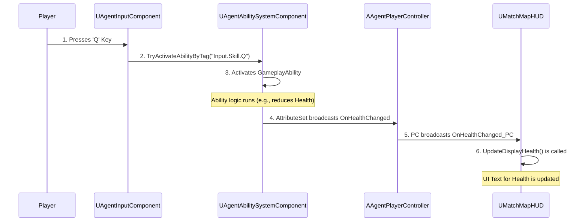

# Input, HUD, and ASC Integration

## 1. Design Goals & Rationale

The integration between player input, the Heads-Up Display (HUD), and the Gameplay Ability System (GAS) Component (ASC) was designed with these core goals:

1.  **Decoupling with Gameplay Tags**: The input handling logic is completely decoupled from the ability activation logic. The input component doesn't know *what* skill it's activating; it only sends a generic signal (e.g., "Ability 1 key pressed") using a `GameplayTag`. The `AbilitySystemComponent` is responsible for interpreting this tag and activating the corresponding ability. This allows for easy remapping of keys and abilities without changing C++ code.

2.  **Centralized Data Hub (ASC)**: The `AbilitySystemComponent` acts as the single source of truth for all gameplay-related player data, including attributes (health, armor) and ability states (cooldowns, stacks). The HUD's responsibility is purely to *visualize* this data, not to store or manage its state.

3.  **Event-Driven UI Updates**: The HUD updates reactively to changes in the ASC. Instead of checking for data changes every frame (ticking), the HUD binds its update functions to delegates in the `PlayerController` and `PlayerState`. When an attribute or ability stack changes on the server and replicates, these delegates are broadcast, triggering a UI update automatically. This is far more efficient and ensures the UI is always synchronized with the authoritative game state.

## 2. Architecture

The data flows in two primary directions: from the player's input to the ASC to activate abilities, and from the ASC's data changes back to the HUD for visualization.

### Key Classes & Components

*   **`UAgentInputComponent`**: A component on the `ABaseAgent` that uses the Enhanced Input system. It binds hardware inputs (e.g., the 'Q' key) to `UInputAction` assets and defines handler functions for them.
*   **`UAgentAbilitySystemComponent`**: The agent's ASC. It holds all abilities and attributes. It features the crucial `TryActivateAbilityByTag` function, which is the entry point for all tag-based ability activations.
*   **`AAgentPlayerController`**: Acts as a middleman for broadcasting delegates. It subscribes to changes in its owned `AttributeSet` and exposes its own delegates (e.g., `OnHealthChanged_PC`) for the HUD to bind to.
*   **`UMatchMapHUD`**: The main UMG widget for the in-game HUD. It contains all the child widgets for health, ammo, abilities, etc. It binds its update functions to the delegates provided by the `PlayerController` and `PlayerState`.

### Data Flow Diagram (Mermaid.js)



## 3. Core Logic Analysis

### Input to ASC: Activating an Ability

The `UAgentInputComponent` binds a key press directly to a function that calls `TryActivateAbilityByTag` on the ASC. This is the heart of the input-to-ability pipeline.

```cpp
// In UAgentInputComponent.cpp
// GitHub Link: (Provide actual link here)

void UAgentInputComponent::AbilityQInput(const FInputActionValue& InputActionValue)
{
    // Directly get the ASC and activate the ability using a hardcoded tag.
	Agent->GetASC()->TryActivateAbilityByTag(FGameplayTag::RequestGameplayTag(FName("Input.Skill.Q")));
}
```
*   **Intent**: This code demonstrates extreme decoupling. The input component has no reference to any specific ability like "Phoenix Curveball." It only knows about the generic "Q Skill" input tag. Any agent can be assigned an ability with this tag, and the Q key will correctly activate it.

### ASC to HUD: Updating Health Display

The `UMatchMapHUD` binds its UI update functions to delegates during its initialization. This event-driven approach is efficient and ensures data consistency.

```cpp
// In UMatchMapHUD.cpp
// GitHub Link: (Provide actual link here)

void UMatchMapHUD::BindToDelegatePC(UAgentAbilitySystemComponent* asc, AAgentPlayerController* pc)
{
    // ... other bindings ...

    // The HUD's UpdateDisplayHealth function is bound to the PlayerController's delegate.
	pc->OnHealthChanged_PC.AddDynamic(this, &UMatchMapHUD::UpdateDisplayHealth);
	pc->OnArmorChanged_PC.AddDynamic(this, &UMatchMapHUD::UpdateDisplayArmor);
}

void UMatchMapHUD::UpdateDisplayHealth(const float health, bool bIsDamage)
{
    // This function is now automatically called whenever the delegate is broadcast.
	int32 intHealth = FMath::TruncToInt(health);
	txt_HP->SetText(FText::AsNumber(intHealth));
}
```
*   **Intent**: The HUD does not need to constantly check if the player's health has changed. It subscribes to a "health changed" event once. When the player's health attribute is modified (e.g., by taking damage), the `AttributeSet` notifies the `PlayerController`, which in turn broadcasts the delegate, and `UpdateDisplayHealth` is executed automatically, ensuring the UI is always a correct reflection of the player's state.

## 4. Implementation & Problem Solving

### Implementation Result

This architecture successfully powers the entire player feedback loop. When a player presses 'Q', the corresponding ability activates. If that ability costs a charge, the `PlayerState`'s `OnAbilityStackChanged` delegate fires, and the `UMatchMapHUD`'s `HandleAbilityStackChanged` function is called, updating the ability icon's stack count. If the player takes damage, the `AttributeSet`'s health value changes, firing the `OnHealthChanged_PC` delegate and causing the health text on the HUD to update instantly.

<!-- [[Video: Full interaction loop - Player uses an ability, takes damage, and the HUD updates in real-time.mp4]] -->

### Technical Problem & Solution: HUD Not Updating on Initial Spawn

*   **Problem**: When a player first spawned, the HUD would sometimes show default or incorrect values (e.g., 0 health) for a brief moment before snapping to the correct values.
*   **Cause**: The HUD widget was being created and was attempting to bind to delegates *before* the `PlayerState` and `AbilitySystemComponent` on the server had fully initialized and replicated their initial data to the client.
*   **Solution**:
    1.  The binding logic in `UMatchMapHUD::NativeConstruct` was made more robust. It now ensures that the `PlayerController` and `PlayerState` are valid before attempting to bind delegates.
    2.  An explicit initialization function, `InitUI(AAgentPlayerState* ps)`, was added to the HUD. This function is called once the `PlayerState` is confirmed to be valid. It directly sets the initial values for Health and Armor (`txt_HP->SetText(...)`).
    3.  On the `PlayerState`, a `Server_RequestAbilityStackSync()` function was added. After the HUD binds its delegates, it calls this function, which asks the server to send a guaranteed update of all current ability stacks, ensuring the UI is correct from the very first frame.
*   **Lesson**: In a networked environment, you cannot assume the order of initialization on clients. UI elements that depend on replicated data must be prepared to handle null or default data initially and have a robust mechanism to populate themselves with the correct data once it becomes available, both through initial setup functions and event-driven updates.

## 5. Related Systems

*   **[GAS Introduction & Architecture](./GAS-Intro.md)**: The `AbilitySystemComponent` (ASC) is the central data provider for the HUD.
*   **[Shop & Economy System](./Shop-Economy.md)**: Purchasing ability charges in the shop directly modifies ability stacks, which are then reflected in the HUD through this system.
