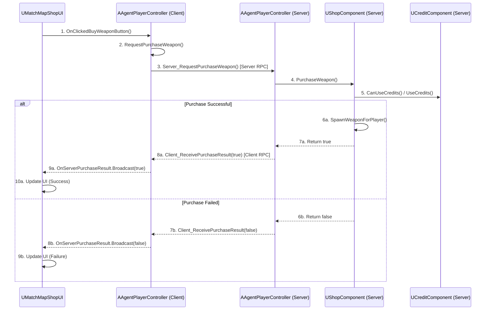

# 상점 및 경제 시스템

## 1. 설계 목표 및 근거 (Design Goals & Rationale)

상점 및 경제 시스템은 게임의 전략적 깊이를 더하는 핵심 요소로, 설계 시 다음 목표에 중점을 두었습니다.

1.  **서버 권위적(Server-Authoritative) 구조**: 아이템 구매, 재화 차감 및 지급 등 모든 경제 관련 핵심 로직은 반드시 서버에서만 처리되도록 설계했습니다. 클라이언트는 단지 서버에 '구매 요청'을 보내는 역할만 하며, 실제 데이터 변경은 모두 서버의 검증을 거친 후에만 이루어집니다. 이는 클라이언트 변조를 통한 부당 이득 취득을 원천적으로 차단하는 가장 중요한 설계 목표입니다.

2.  **역할의 명확한 분리**: 시스템을 UI(`UMatchMapShopUI`), 요청 중계(`AAgentPlayerController`), 구매 로직(`UShopComponent`), 재화 데이터(`UCreditComponent`), 재화 분배(`AMatchGameMode`)의 5가지 역할로 명확히 분리했습니다. 이를 통해 각 부분의 코드가 자신의 책임에만 집중하게 하여, 시스템의 복잡도를 낮추고 유지보수성을 크게 향상시켰습니다.

3.  **데이터 기반 아이템 관리**: 상점에서 판매하는 모든 아이템의 정보(가격, 종류 등)는 `UValorantGameInstance`에 중앙 집중화하여, 밸런스 수정이나 아이템 추가 시 C++ 코드를 수정할 필요 없이 데이터 에셋만으로 대응할 수 있도록 설계했습니다.

## 2. 아키텍처 (Architecture)

본 시스템은 클라이언트의 UI에서 시작된 구매 요청이 `PlayerController`를 통해 서버로 전달되고, 서버의 여러 컴포넌트가 연쇄적으로 동작한 후 다시 클라이언트로 결과를 반환하는 명확한 RPC(Remote Procedure Call) 기반 아키텍처를 가집니다.

### 핵심 클래스 및 컴포넌트

*   **`UMatchMapShopUI`**: 상점 UI 위젯입니다. 플레이어의 구매 버튼 클릭 시, `AAgentPlayerController`의 `RequestPurchase...` 함수를 호출하여 구매 절차를 시작합니다.
*   **`AAgentPlayerController`**: 클라이언트와 서버 간의 중계자 역할을 합니다. UI의 요청을 받아 서버 RPC(`Server_RequestPurchase...`)를 호출하고, 서버의 처리 결과를 다시 클라이언트 RPC(`Client_ReceivePurchaseResult`)를 통해 UI에 전달합니다.
*   **`UShopComponent`**: `AAgentPlayerController`에 부착되며, **서버 측에서** 실제 구매 로직을 처리합니다. 아이템 유효성, 구매 조건, 플레이어 재화 등을 모두 검증하고 아이템을 지급하는 역할을 담당합니다.
*   **`UCreditComponent`**: `AAgentPlayerState`에 부착되며, 플레이어의 재화(`CurrentCredit`)를 서버 권위적으로 관리합니다.
*   **`AMatchGameMode`**: 라운드 결과에 따른 재화 분배를 총괄합니다. 라운드 종료 시, 모든 플레이어의 `CreditComponent`에 직접 접근하여 보상 크레딧을 지급합니다.

### 구매 요청 시퀀스 다이어그램 (Mermaid.js)



## 3. 핵심 로직 분석 (Core Logic)

### 안전한 구매 요청 파이프라인

구매 요청은 3단계 RPC 함수 호출을 통해 클라이언트 -> 서버 -> 클라이언트로 이어지는 안전한 파이프라인을 구성합니다.

```cpp
// In AgentPlayerController.h & .cpp
// [GitHub에서 전체 코드 보기](...)

// 1. UI가 호출하는 클라이언트 함수
void AAgentPlayerController::RequestPurchaseWeapon(int32 WeaponID)
{
    // 서버에 RPC를 보내는 것 외에 다른 로직은 없음
	Server_RequestPurchaseWeapon(WeaponID);
}

// 2. 서버에서만 실행되는 실제 로직을 호출하는 RPC
void AAgentPlayerController::Server_RequestPurchaseWeapon_Implementation(int32 WeaponID)
{
	AAgentPlayerState* PS = GetPlayerState<AAgentPlayerState>();
	if (PS && ShopComponent)
	{
        // 서버에 있는 ShopComponent의 구매 함수를 호출
		ShopComponent->PurchaseWeapon(WeaponID);
	}
}

// 3. 서버가 클라이언트로 결과를 반환하는 RPC
void AAgentPlayerController::Client_ReceivePurchaseResult_Implementation(
	bool bSuccess, int32 ItemID, EShopItemType ItemType, const FString& FailureReason)
{
    // 결과 델리게이트를 브로드캐스트하여 UI가 반응하도록 함
	OnServerPurchaseResult.Broadcast(bSuccess, ItemID, ItemType, FailureReason);
}
```
*   **의도**: 이 구조는 클라이언트가 절대로 직접 구매 로직을 실행할 수 없도록 보장합니다. 클라이언트는 오직 `RequestPurchaseWeapon`을 통해 서버에 '요청'만 할 수 있으며, 모든 검증과 실제 데이터 변경(재화 차감, 아이템 지급)은 `Server_RequestPurchaseWeapon_Implementation` 내부에서 서버 단독으로 안전하게 처리됩니다. 이는 멀티플레이어 게임에서 가장 표준적이고 보안성이 높은 설계 방식입니다.

## 4. 구현 결과 및 설계 의도

### 구현 결과

이 서버 권위적 아키텍처를 통해, 플레이어는 구매 단계에서 UI를 통해 아이템 구매를 '요청'하고, 서버의 허가가 떨어지면 안전하게 아이템을 지급받습니다. 라운드 결과에 따른 크레딧 획득 역시 `GameMode`에 의해 서버에서 직접 처리되어 `CreditComponent`에 반영되고, 이 값은 클라이언트의 UI에 자동으로 동기화됩니다.

<!-- [[영상: 상점에서 무기와 스킬을 구매하고, 라운드 승리 후 크레딧을 받는 영상.mp4]] -->

### 설계 의도: 왜 이 구조를 선택했는가?

초기 개발 단계에서 구매 로직을 클라이언트의 `ShopComponent`에서 모두 처리하는 방식을 고려할 수도 있었습니다. 이는 구현이 빠르고 간단하다는 장점이 있지만, 다음과 같은 치명적인 보안 취약점을 야기합니다.

*   **메모리 조작**: 악의적인 사용자가 클라이언트의 메모리를 조작하여 자신의 크레딧 값을 임의로 높일 수 있습니다.
*   **네트워크 패킷 변조**: 클라이언트가 서버로 보내는 구매 요청 패킷을 가로채거나 변조하여, 실제 가격보다 낮은 가격으로 아이템을 구매하거나 제한된 아이템을 구매할 수 있습니다.

이러한 취약점을 원천적으로 차단하기 위해, **'클라이언트는 절대 신뢰하지 않는다(Never Trust the Client)'** 는 멀티플레이어 게임 개발의 제1원칙에 따라 현재의 서버 권위적 RPC 구조를 채택했습니다. 모든 중요한 결정과 데이터 변경은 오직 서버의 손에서만 이루어지므로, 클라이언트에서 어떤 조작이 발생하더라도 실제 게임 경제에는 아무런 영향을 미치지 못합니다. 이 구조는 약간의 복잡성을 대가로, 게임 경제 시스템의 안정성과 공정성을 보장하는 가장 확실한 방법입니다.

## 5. 관련 시스템 (Related Systems)

*   **[Input 및 HUD와 ASC 연동](./Input-HUD-ASC.md)**: 상점 UI를 열고 닫는 입력 처리, 그리고 현재 보유 크레딧을 HUD에 표시하는 로직이 이 시스템과 연관됩니다.
*   **[GAS 소개 및 아키텍처](./GAS-Intro.md)**: 상점에서 구매하는 스킬 충전 횟수는 서버의 `ShopComponent`가 플레이어의 `AbilitySystemComponent`에 `GameplayEffect`를 적용하는 방식으로 처리됩니다.
