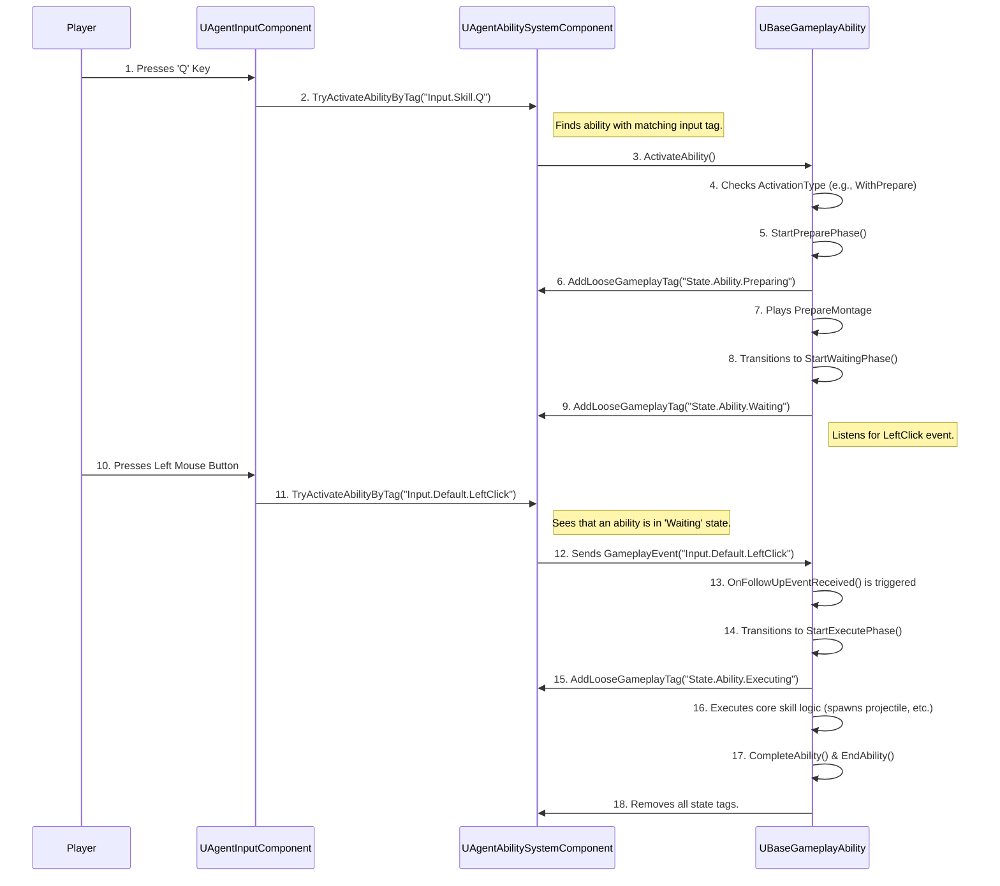

# 어빌리티 기반 클래스와 활성화 흐름

이전 아키텍처 문서에서 설명한 구조 위에서, 모든 스킬의 실질적인 동작을 책임지는 `UBaseGameplayAbility` 클래스와, 플레이어의 입력이 실제 스킬 실행으로 이어지는 전체 데이터 흐름을 상세히 분석합니다.

## 1. UBaseGameplayAbility 심층 분석

`UBaseGameplayAbility`는 이 프로젝트의 모든 스킬(12종 이상)이 상속받는 부모 클래스입니다. 이 클래스는 스킬 구현에 필요한 공통적인 기능들을 추상화하여 제공하며, 특히 **3단계 상태 머신**은 이 클래스의 핵심적인 설계 사상입니다.

### 3단계 상태 머신 (3-Stage State Machine)

모든 스킬은 내부적으로 `Preparing` -> `Waiting` -> `Executing`의 3단계 상태를 가질 수 있으며, 각 상태는 다음과 같은 역할을 합니다.

*   **`State.Ability.Preparing`**: 스킬이 발동되기 전의 준비 단계입니다. 주로 조준 UI를 표시하거나, 스킬 시전을 위한 선행 애니메이션을 재생합니다. 이 상태에서는 언제든지 스킬을 취소할 수 있습니다.
*   **`State.Ability.Waiting`**: 준비 단계가 끝난 후, 플레이어의 추가적인 입력(예: 마우스 좌클릭/우클릭)을 기다리는 상태입니다. 이 상태에서는 일정 시간이 지나면 자동으로 스킬이 취소되는 타임아웃 로직이 있습니다.
*   **`State.Ability.Executing`**: 실제 스킬의 핵심 로직이 실행되는 단계입니다. 이 상태에 진입하면 스킬 스택이 소모되고, 쿨다운이 적용되며, 투사체를 발사하거나 즉시 효과를 적용하는 등의 동작이 이루어집니다. 이 상태에서는 기본적으로 다른 행동으로 스킬을 취소할 수 없습니다.

### 활성화 타입 (Activation Type)

`UBaseGameplayAbility`는 `EAbilityActivationType`이라는 열거형 변수를 통해 스킬이 어떤 방식으로 상태 머신을 시작할지 결정합니다.

*   **`EAbilityActivationType::Instant`**: 스킬 키를 누르는 즉시 `Executing` 상태로 진입합니다. (예: 제트의 순풍)
*   **`EAbilityActivationType::WithPrepare`**: 스킬 키를 누르면 `Preparing` 상태부터 순서대로 상태 머신을 시작합니다. (예: 피닉스의 불길)

## 2. 스킬 활성화 타입별 구현 예시

이 상태 머신과 활성화 타입 덕분에, 대부분의 스킬은 단지 `UBaseGameplayAbility`를 상속받는 블루프린트를 만들고, 타입과 애셋(애니메이션, 파티클 등)만 지정해주면 새로운 C++ 코드 없이도 구현이 가능했습니다.

### Instant 타입 예시: 세이지의 '치유 구슬'

세이지의 치유 구슬(E 스킬)은 아군을 조준하고 스킬 키를 누르면 즉시 치유 효과가 적용되는 스킬입니다. 이 어빌리티 블루프린트의 설정은 다음과 같습니다.

*   **`ActivationType`**: `Instant`
*   **`ExecuteMontage`**: 치유 구슬을 던지는 1인칭/3인칭 몽타주
*   **`ExecuteEffect`**: 치유 대상에게 적용될 `GameplayEffect` (초당 체력 회복)

개발자는 단지 이 데이터들을 채워 넣기만 하면, `UBaseGameplayAbility`의 `StartExecutePhase` 로직이 자동으로 애니메이션을 재생하고 `GameplayEffect`를 적용해줍니다.

### WithPrepare 타입 예시: 피닉스의 '불길'

피닉스의 불길(C 스킬)은 스킬 키를 눌러 조준을 시작하고(`Preparing`), 마우스 버튼을 누르고 있는 동안 벽을 생성하며 휘게 만들고(`Waiting`), 버튼을 떼면 스킬이 종료되는 복합적인 스킬입니다.

*   **`ActivationType`**: `WithPrepare`
*   **`FollowUpInputType`**: `LeftClick` (좌클릭 입력을 기다림)
*   **`PrepareMontage`**: 불길을 손에 드는 몽타주
*   **`WaitingMontage`**: 불길을 들고 있는 상태의 루프 몽타주
*   **`ExecuteAbility` (오버라이드)**: `ABlazeWall` 액터를 스폰시키고, 플레이어의 마우스 이동에 따라 벽이 휘어지도록 하는 커스텀 로직을 C++로 구현.

이처럼 복잡한 스킬의 경우, 데이터만으로 처리할 수 없는 고유한 로직만 C++ `ExecuteAbility` 함수에 오버라이드하여 구현함으로써, 상태 관리나 애니메이션 처리와 같은 공통 로직의 재사용성을 극대화했습니다.

## 3. 전체 활성화 흐름 (The Complete Activation Flow)

플레이어의 키 입력 하나가 실제 스킬 실행으로 이어지기까지, 데이터는 다음과 같은 정교한 파이프라인을 통해 흐릅니다.

## 4. 문제 해결: 후속 입력(Follow-up Input)의 안정적인 처리

*   **문제**: `WithPrepare` 타입의 스킬에서, `Waiting` 상태일 때 마우스 클릭과 같은 후속 입력을 받아 처리하는 과정이 불안정했습니다. 예를 들어, 입력을 너무 빨리하면 씹히거나, 특정 상황에서 이벤트가 전달되지 않는 문제가 있었습니다.
*   **원인**: 초기에는 `Tick` 함수에서 `IsInputPressed`와 같은 함수로 직접 입력을 체크하려고 시도했습니다. 이 방식은 프레임에 따라 입력을 놓칠 수 있고, 다른 어빌리티와의 상호작용을 고려하기 어려워 매우 불안정했습니다.
*   **해결 과정**:
    1.  GAS가 제공하는 `AbilityTask_WaitGameplayEvent` 태스크를 활용하기로 결정했습니다. 이 태스크는 특정 `GameplayTag`를 가진 이벤트가 발생할 때까지 어빌리티의 실행을 잠시 멈추고 기다리는 역할을 합니다.
    2.  `StartWaitingPhase` 함수 내에서, `FollowUpInputType`에 따라 `AbilityTask_WaitGameplayEvent`를 생성하고, 기다릴 이벤트 태그(예: `Input.Default.LeftClick`)를 지정해 주었습니다.
    3.  `UAgentAbilitySystemComponent::TryActivateAbilityByTag` 함수를 수정하여, 만약 어떤 어빌리티가 `State.Ability.Waiting` 태그를 가지고 있다면, 들어온 입력을 새로운 어빌리티 활성화로 처리하는 대신, `FGameplayEventData`로 감싸서 현재 활성화된 어빌리티에 전달하도록 했습니다.
    4.  이 구조 덕분에, `Waiting` 상태의 어빌리티는 `OnFollowUpEventReceived` 델리게이트를 통해 안정적으로 후속 입력 이벤트를 수신하고, `StartExecutePhase`로 상태를 전환할 수 있게 되었습니다.
*   **교훈**: 복잡한 비동기 로직이나 입력 처리는 직접 `Tick`에서 구현하기보다, GAS가 제공하는 어빌리티 태스크(AbilityTask)를 적극적으로 활용하는 것이 훨씬 안정적이고 재사용 가능한 코드를 만드는 방법임을 배웠습니다. 특히 `WaitGameplayEvent` 태스크는 상태 머신과 결합될 때 매우 강력한 무기가 되었습니다.

## 5. 관련 시스템 (Related Systems)

*   **[GAS 아키텍처](./Skill-System-Architecture.md)**: 이 문서에서 설명하는 `UBaseGameplayAbility`는 해당 아키텍처의 핵심 구성 요소입니다.
*   **[확장 가능한 스킬 대량 구현](./Scalable-Skill-Production.md)**: 이 `UBaseGameplayAbility` 클래스가 어떻게 12가지가 넘는 스킬을 효율적으로 생산하는 기반이 되었는지 설명합니다.
