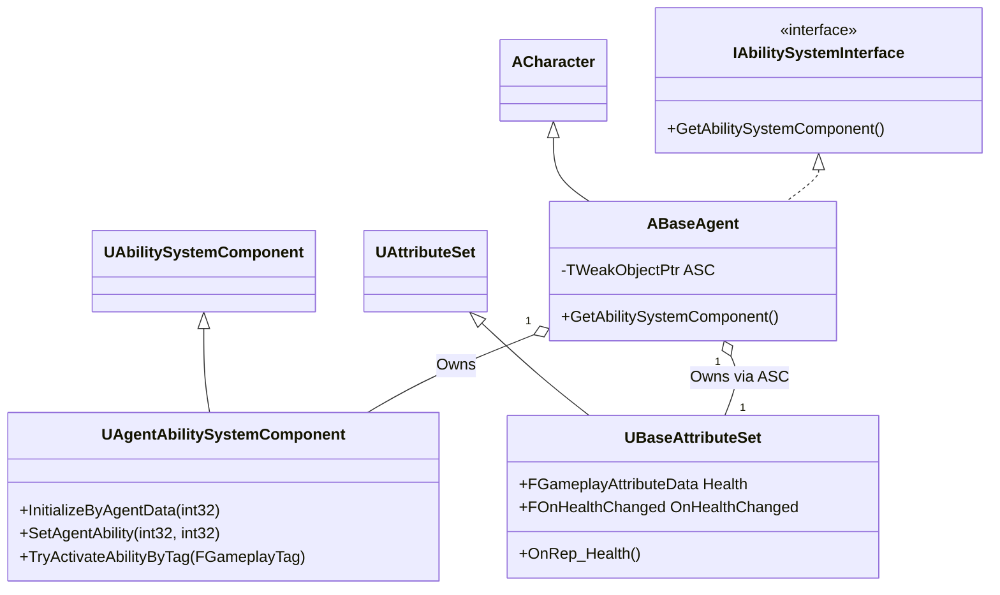

# GAS 아키텍처 (GAS Architecture)

## 1. 설계 목표 및 근거 (Design Goals & Rationale)

이 프로젝트는 언리얼 엔진의 Gameplay Ability System (GAS)을 그대로 사용하지 않고, 프로젝트의 특성에 맞게 핵심 클래스들을 상속받아 확장하는 방식으로 설계되었습니다. 여기에는 다음과 같은 명확한 설계 목표가 있었습니다.

1.  **데이터 기반 설계 (Data-Driven Design)**: 새로운 요원을 추가하거나 스킬을 교체할 때, C++ 코드를 수정하는 것이 아니라 데이터 테이블(`UDataTable`)이나 데이터 에셋을 수정하는 것만으로 가능하도록 하는 것을 목표로 했습니다. 이를 위해 `UAgentAbilitySystemComponent`에 `InitializeByAgentData`와 같은 함수를 구현하여, 에이전트 ID만으로 관련된 모든 속성과 어빌리티를 자동으로 부여하도록 설계했습니다.

2.  **입력과 로직의 완전한 분리 (Decoupling Input from Logic)**: 플레이어의 키 입력(예: 'Q' 키)과 실제 실행되는 스킬(예: '피닉스 커브볼')의 관계를 하드코딩하지 않는 것을 목표로 했습니다. `GameplayTag`를 중간 다리로 사용하여, `UAgentInputComponent`는 단지 `Input.Skill.Q`라는 태그를 `UAgentAbilitySystemComponent`에 보낼 뿐입니다. 그러면 ASC가 현재 캐릭터가 가진 어빌리티 중 해당 태그가 부여된 것을 찾아 실행합니다. 이 덕분에 어떤 캐릭터든 `Input.Skill.Q` 태그를 가진 어빌리티를 장착하면 'Q' 키로 스킬을 사용할 수 있습니다.

3.  **중앙화된 데이터 및 반응형 업데이트 (Centralized Data & Reactive Updates)**: 캐릭터의 모든 핵심 수치(체력, 방어력 등)는 `UBaseAttributeSet`에서만 관리하도록 역할을 중앙화했습니다. 외부 시스템(특히 HUD)은 이 데이터를 직접 참조하는 대신, `AttributeSet`이 제공하는 델리게이트(`OnHealthChanged` 등)에 자신의 업데이트 함수를 바인딩합니다. 이를 통해 데이터가 변경될 때만 UI가 반응하여 업데이트되므로, 매 프레임 데이터를 체크하는 비효율적인 방식을 피하고 시스템 간의 의존성을 낮췄습니다.

## 2. 아키텍처 (Architecture)

본 프로젝트의 GAS 아키텍처는 `ABaseAgent`를 중심으로, 커스터마이징된 `UAgentAbilitySystemComponent`와 `UBaseAttributeSet`이 유기적으로 연결된 구조입니다.

### 핵심 클래스 분석

*   **`ABaseAgent`**: 모든 플레이어 캐릭터의 부모 클래스입니다. `IAbilitySystemInterface`를 구현하며, `GetAbilitySystemComponent()` 함수를 통해 자신의 `UAgentAbilitySystemComponent` 인스턴스를 외부에 제공하는 역할을 합니다.

*   **`UAgentAbilitySystemComponent`**: `UAbilitySystemComponent`를 상속받은 프로젝트의 핵심 허브입니다. 다음과 같은 커스텀 기능이 구현되어 있습니다.
    *   **데이터 기반 초기화**: `InitializeByAgentData(agentID)` 함수를 통해, 데이터 테이블에 정의된 에이전트의 초기 속성과 어빌리티 목록을 가져와 자동으로 적용합니다.
    *   **동적 입력 태그 부여**: `SetAgentAbility` 함수는 어빌리티를 부여할 때, 해당 어빌리티 에셋에 정의된 태그(예: `Ability.Skill.Phoenix.Curveball`)와 함께, 이 어빌리티를 발동시킬 입력 태그(예: `Input.Skill.Q`)를 `FGameplayAbilitySpec`에 동적으로 함께 주입합니다.
    *   **지능적인 어빌리티 활성화**: `TryActivateAbilityByTag` 함수는 단순히 태그로 어빌리티를 실행하는 것을 넘어, 만약 다른 스킬이 후속 입력을 기다리는 `Waiting` 상태일 경우, 새로운 스킬을 활성화하는 대신 해당 입력을 `GameplayEvent`로 변환하여 기존 스킬에 전달하는 정교한 로직을 포함합니다.

*   **`UBaseAttributeSet`**: `UAttributeSet`을 상속하며, 체력(Health), 방어력(Armor) 등 모든 캐릭터의 공통 속성을 정의합니다. 속성 값이 서버에서 변경되면 `OnRep_` 함수(예: `OnRep_Health`)가 클라이언트에서 호출되고, 이 함수는 `OnHealthChanged`와 같은 델리게이트를 브로드캐스트하여 HUD와 같은 외부 시스템에 데이터 변경을 전파합니다.

### 클래스 다이어그램 (Mermaid.js)



## 3. 핵심 로직 분석 (Core Logic)

### 데이터 기반 어빌리티 부여

`UAgentAbilitySystemComponent::SetAgentAbility` 함수는 이 아키텍처의 데이터 기반 설계와 입력-로직 분리 사상을 가장 잘 보여주는 코드입니다. 어빌리티를 부여할 때, 어빌리티 자체의 태그와 그것을 발동시킬 입력 태그를 동적으로 연결합니다.

```cpp
// In AgentAbilitySystemComponent.cpp

void UAgentAbilitySystemComponent::SetAgentAbility(int32 abilityID, int32 level)
{
    // ... (abilityData 로드)

    // 어빌리티 에셋 자체에 정의된 태그를 가져옴
    const FGameplayTagContainer& tagCon = ga->GetAssetTags();

    // ...

    // 스킬 슬롯 태그(Input.Skill.Q 등)가 있는지 확인
    for (const FGameplayTag& tag : tagCon)
    {
        if (SkillTags.Contains(tag))
        {
            skillTag = tag; // skillTag는 "Input.Skill.Q"가 됨
            bIsSkill = true;
            break;
        }
    }

    // ...

    // 어빌리티 스펙을 생성하고, 여기에 입력 태그를 동적으로 주입
    FGameplayAbilitySpec spec(abilityClass, level);
    spec.GetDynamicSpecSourceTags().AddTag(skillTag);
    GiveAbility(spec);
}
```
*   **의도**: 이 로직 덕분에, `피닉스_커브볼` 어빌리티 에셋에 `Input.Skill.Q` 태그를 추가해두기만 하면, `SetAgentAbility` 함수가 자동으로 'Q' 키 입력과 이 어빌리티를 연결해줍니다. 어떤 어빌리티든 원하는 입력 키에 연결하는 작업이 데이터 수정만으로 가능해집니다.

### 속성 변경 감지 및 전파

`UBaseAttributeSet`의 `OnRep_Health` 함수는 서버에서 변경된 체력 값이 어떻게 클라이언트의 UI에까지 안전하게 전달되는지를 보여줍니다. 이 간단한 함수가 반응형 UI 업데이트의 핵심입니다.

```cpp
// In BaseAttributeSet.cpp

void UBaseAttributeSet::GetLifetimeReplicatedProps(TArray<FLifetimeProperty>& OutLifetimeProps) const
{
    Super::GetLifetimeReplicatedProps(OutLifetimeProps);
    // Health 속성이 서버에서 변경되면, OnRep_Health 함수를 클라이언트에서 호출하도록 설정
    DOREPLIFETIME_CONDITION_NOTIFY(UBaseAttributeSet, Health, COND_None, REPNOTIFY_Always);
}

void UBaseAttributeSet::OnRep_Health(const FGameplayAttributeData& OldHealth)
{
    // 서버로부터 복제된 새 Health 값을 사용하여, 클라이언트의 델리게이트를 브로드캐스트함
    OnHealthChanged.Broadcast(Health.GetCurrentValue(), CachedWasDamaged);
}
```
*   **의도**: 서버에서 플레이어가 피해를 입어 `Health` 속성 값이 변경되면, 이 값은 언리얼 엔진의 리플리케이션 시스템에 의해 모든 클라이언트로 복제됩니다. 클라이언트에서 복제가 완료되는 순간 `OnRep_Health` 함수가 자동으로 호출되고, 이 함수는 `OnHealthChanged` 델리게이트를 실행시킵니다. HUD 위젯은 이 델리게이트에 자신의 UI 업데이트 함수를 미리 바인딩해두었기 때문에, 최종적으로 화면의 체력 바가 갱신됩니다. 이 과정을 통해 데이터의 흐름이 서버 -> 클라이언트 -> UI로 명확하고 안정적으로 이어집니다.

## 4. 관련 시스템 (Related Systems)

*   **[어빌리티 기반 클래스와 활성화 흐름](./BaseGameplayAbility-and-Activation-Flow.md)**: 이 아키텍처 위에서 실제 어빌리티들이 어떻게 동작하는지에 대한 상세 설명입니다.
*   **[Input 및 HUD와 ASC 연동](./Input-HUD-ASC.md)**: 이 아키텍처의 데이터를 소비하여 플레이어에게 입력을 받고 시각적 피드백을 제공하는 시스템입니다.
*   **[확장 가능한 스킬 대량 구현](./Scalable-Skill-Production.md)**: 이 아키텍처가 어떻게 다수의 스킬을 효율적으로 생산할 수 있게 했는지 보여주는 문서입니다.
