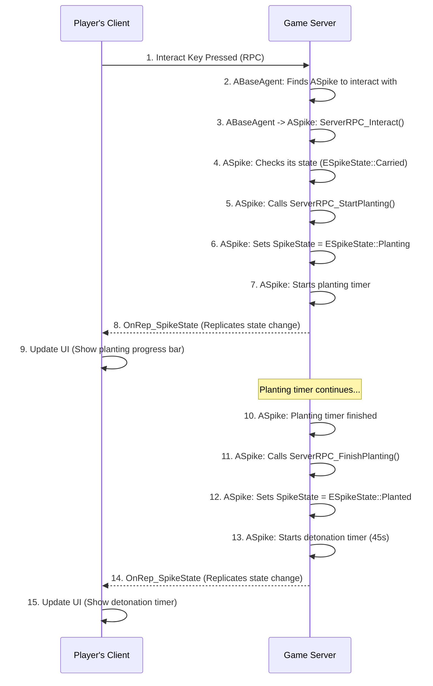

# Spike 시스템

## 1. 설계 목표 및 근거 (Design Goals & Rationale)

스파이크 시스템은 발로란트의 핵심 목표(Objective)이며, 설계 시 다음 목표에 중점을 두었습니다.

1.  **상태 관리의 중앙 집중화**: 스파이크의 모든 상태(소지, 설치 중, 해체 완료 등)와 관련 로직을 `ASpike` 액터 내에서 모두 처리하도록 설계했습니다. 별도의 어빌리티 클래스에 로직을 분산시키는 대신, `ASpike`가 자신의 상태를 직접 관리하는 '스마트 액터'가 되도록 하여, 스파이크와 관련된 모든 코드를 한 곳에서 파악하고 수정할 수 있도록 했습니다.

2.  **서버 권위적(Server-Authoritative) 구조**: 스파이크의 상태 변경, 타이머, 상호작용 진행률 등 모든 핵심 데이터는 서버에서만 수정 가능하도록 설계했습니다. 클라이언트는 서버의 RPC 호출을 통해서만 상태를 업데이트받으며, 이를 통해 클라이언트 변조나 네트워크 지연으로 인한 상태 불일치 문제를 원천적으로 차단했습니다.

3.  **유연한 상호작용**: 플레이어의 상호작용(`Interact`) 입력을 받았을 때, `ASpike` 액터가 현재 자신의 상태(`ESpikeState`)를 스스로 판단하여 '설치'를 시작할지 '해체'를 시작할지 결정하도록 했습니다. 이를 통해 플레이어의 상호작용 로직은 어떤 대상과 상호작용하는지 알 필요 없이 단일한 인터페이스를 유지할 수 있었습니다.

## 2. 아키텍처 (Architecture)

스파이크 시스템은 `ABaseAgent`와 `ASpike` 액터 간의 RPC 통신을 기반으로 구축되었습니다.

### 핵심 클래스 및 컴포넌트

*   **`ABaseAgent`**: 플레이어 캐릭터입니다. 상호작용 키를 누르면 현재 바라보고 있는 `ABaseInteractor` (이 경우 `ASpike`)에게 서버 RPC로 상호작용을 요청(`ServerRPC_Interact`)합니다.
*   **`ASpike`**: 스파이크 액터이자 시스템의 핵심입니다. `ESpikeState` 열거형을 통해 자신의 상태를 관리하는 상태 머신을 가지고 있습니다. 모든 상태 변경은 이 클래스 내부의 서버 RPC 함수(`ServerRPC_StartPlanting`, `ServerRPC_FinishDefusing` 등)를 통해서만 이루어집니다.
*   **`AMatchGameState`**: 게임의 전체 상태를 관리합니다. `ASpike`는 자신의 상태가 최종 상태(폭발 또는 해체 완료)가 되면 `AMatchGameState`에 이를 알려 라운드 종료를 트리거합니다.

### 시퀀스 다이어그램 (Mermaid.js)

스파이크 설치 과정의 데이터 흐름은 다음과 같습니다.



## 3. 핵심 로직 분석 (Core Logic)

### 상호작용 분기 처리

`ASpike`의 `ServerRPC_Interact_Implementation` 함수는 이 시스템의 핵심적인 설계 사상을 보여줍니다. 이 단일 함수가 스파이크의 현재 상태에 따라 전혀 다른 두 가지(설치/해체) 로직을 어떻게 분기 처리하는지 보여줍니다.

```cpp
// 실제 GitHub 링크는 여기에 삽입하세요.
// [GitHub에서 전체 코드 보기](...)

void ASpike::ServerRPC_Interact_Implementation(ABaseAgent* InteractAgent)
{
    // ... Various checks ...

    // 스파이크를 들고 있고, 설치 구역 안에 있을 경우
    if (SpikeState == ESpikeState::Carried && IsInPlantZone())
    {
        ServerRPC_StartPlanting(InteractAgent);
        return;
    }

    // 스파이크가 설치되어 있고, 게임이 진행 중일 경우
    if (SpikeState == ESpikeState::Planted && IsGameStateInRound())
    {
        ServerRPC_StartDefusing(InteractAgent);
        return;
    }
}
```
*   **의도**: 이 코드는 '상호작용'이라는 하나의 사용자 입력에 대해, 객체(`ASpike`)가 자신의 내부 상태를 기반으로 맥락에 맞는 적절한 행동을 스스로 결정하도록 하는 객체 지향적 설계를 보여줍니다. 이를 통해 `ABaseAgent`는 상호작용 대상이 스파이크인지, 문인지, 무기인지 전혀 신경 쓸 필요 없이 일관된 인터페이스로 상호작용을 요청할 수 있습니다.

## 4. 구현 결과 및 문제 해결 (Implementation & Problem Solving)

### 구현 결과

이 아키텍처를 통해 플레이어는 스파이크를 소지한 채 지정된 구역에서 '상호작용' 키를 길게 눌러 설치를 시작하고, 설치된 스파이크에 다가가 다시 '상호작용' 키를 길게 눌러 해체를 시작할 수 있습니다. 해체는 중간에 키를 떼더라도 50% 이상 진행했다면 그 진행도가 저장되는 체크포인트 기능까지 모두 구현되었습니다. 모든 과정은 서버에서 안전하게 처리되며 UI에 실시간으로 반영됩니다.

<!-- [[영상: 스파이크 설치 및 해체 과정.mp4]] -->

### 기술적 문제 해결: 해체 진행도 동기화

*   **문제**: 여러 명의 수비팀 플레이어가 한 스파이크를 번갈아 가며 해체할 때, 진행도가 초기화되거나 잘못 동기화되는 문제가 있었습니다.
*   **원인**: 초기 구현에서는 해체 진행률(`InteractProgress`)을 해제를 시도하는 `ABaseAgent` 측에서 계산하여 동기화하려고 했기 때문입니다. 이로 인해 다른 플레이어가 해체를 이어받을 때 진행률 정보가 유실되거나 꼬이는 현상이 발생했습니다.
*   **해결 과정**:
    1.  해체 진행률(`InteractProgress`)과 마지막 해체 시도자(`LastDefusingAgent`), 그리고 체크포인트 달성 여부(`bIsHalfDefused`)를 모두 `ASpike` 액터의 Replicated 변수로 이전했습니다.
    2.  플레이어가 해체를 시작하면 `ASpike`는 자신의 타이머를 이용해 스스로 `InteractProgress`를 증가시킵니다. 플레이어는 단지 '해체 중'이라는 상태만 유지할 뿐, 진행도 계산에 관여하지 않습니다.
    3.  플레이어가 해체를 중단하면, `ASpike`는 `InteractProgress`가 `HalfDefuseTime`을 넘었는지 확인하고 `bIsHalfDefused` 플래그를 설정합니다. 이 모든 과정은 `ASpike` 내부에서만 이루어집니다.
    4.  다른 플레이어가 해체를 시작하면, `ASpike`는 `bIsHalfDefused` 플래그를 확인하고, 만약 true라면 `InteractProgress`를 0이 아닌 `HalfDefuseTime`부터 시작하도록 처리했습니다.
*   **교훈**: 여러 액터가 상호작용하는 공유 객체의 상태는 반드시 공유 객체 자신이 직접 관리하고 동기화해야 한다는 점을 명확히 배웠습니다. 로직을 수행하는 주체(Agent)가 아니라, 로직의 대상이 되는 객체(Spike)가 데이터의 '소유자(Owner)'가 되어야 데이터 정합성을 보장하고 복잡한 동기화 문제를 단순하게 만들 수 있다는 것을 깨달았습니다.

## 5. 관련 시스템 (Related Systems)

*   **[GAS 소개 및 아키텍처](./GAS-Intro.md)**: 이 시스템의 기반이 되는 상호작용은 GAS의 어빌리티를 통해 시작됩니다.
*   **[Input 및 HUD와 ASC 연동](./Input-HUD-ASC.md)**: 플레이어의 상호작용 키 입력 처리와 스파이크 상태(설치, 해체 진행률)의 UI 표시는 이 시스템과 직접적으로 연관됩니다.
