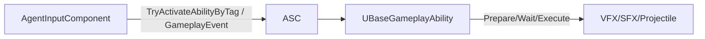
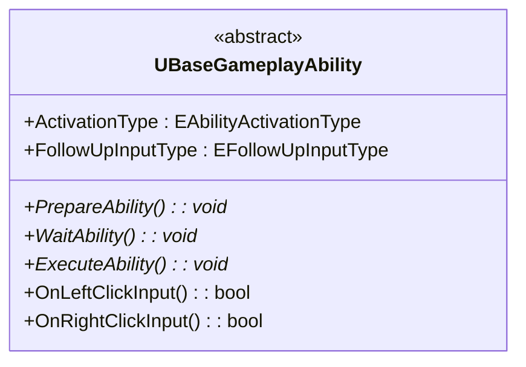
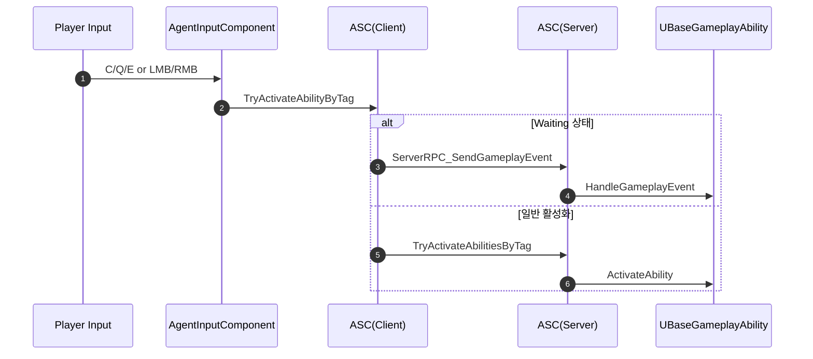

# 01. Ability Framework (GAS)

본 문서는 `UBaseGameplayAbility` 기반의 공통 스킬 프레임워크를 설명합니다. 상태머신, 후속입력 처리, 서버 권위 실행/복제, 투사체/지상효과 스폰 규약을 다룹니다.

## 1. 설계 목표 및 근거 (Design Goals & Rationale)
- 일관된 스킬 수명주기: Preparing → Waiting → Executing → Cleanup을 모든 스킬에 공통 적용
- 입력/네트워크 분리: 후속입력(LMB/RMB) 라우팅과 서버 권위 실행·복제를 명확히 분리
- 재사용성: 투사체/지상효과·애니메이션/사운드 공통 유틸로 파생 스킬 개발 속도 향상

## 2. 아키텍처 (Architecture)
- 핵심 클래스: `UBaseGameplayAbility`(베이스), `UAgentAbilitySystemComponent`(ASC 확장), `UAgentInputComponent`(입력→ASC)
- 데이터 흐름: 입력 태그 → ASC → Ability 상태 전이(Prepare/Wait/Execute) → FX/사운드/복제



## 3. 핵심 로직 분석 (Core Logic)
- [GitHub에서 전체 코드 보기](https://github.com/chungheonLee0325/VALORANT/blob/main/Source/Valorant/AbilitySystem/Abilities/BaseGameplayAbility.h)
- 핵심 지점: 활성화 타입/후속입력, 단계 전이(StartPrepare/StartWaiting/StartExecute)

```cpp
// 활성화/후속입력 타입과 단계 전이 핵심 API
UENUM(BlueprintType)
enum class EAbilityActivationType : uint8 { Instant, WithPrepare };
UENUM(BlueprintType)
enum class EFollowUpInputType : uint8 { None, LeftClick, RightClick, LeftOrRight };

void StartPreparePhase();
void StartWaitingPhase();
void StartExecutePhase(EFollowUpInputType InputType = EFollowUpInputType::None);
virtual bool OnLeftClickInput();
virtual bool OnRightClickInput();
```

설계 의도: 공통 전이 함수를 통해 파생 스킬이 최소 오버라이드만으로도 동일한 UX/복제 규칙을 따르도록 구성.

## 4. 구현 결과 및 문제 해결 (Implementation & Problem Solving)
- 후속입력 이벤트 순서 문제: Waiting 중 입력은 GameplayEvent로만 수신하도록 ASC 라우팅 일원화 → 중복 실행 방지
- 애니메이션 혼합: 1P/3P 몽타주 분리 재생 유틸(PlayMontages)로 레이어링 이슈 최소화
- 스택 처리: `ReduceAbilityStack()`에서 서버 권위 차감 후 멀티캐스트 알림으로 UI 동기화

<!-- TODO(media): 개요 다이어그램/데모 GIF Git URL + 캡션 -->

## 5. 관련 시스템 (Related Systems)
- [02. Agent Abilities](02_Agent_Abilities.md)
- [03. Flash 시스템](03_Flash_System.md)
- [05. Input/HUD & ASC](05_Input_HUD_ASC.md)

## 핵심 파일
- `Source/Valorant/AbilitySystem/Abilities/BaseGameplayAbility.h`
- `Source/Valorant/AbilitySystem/AgentAbilitySystemComponent.cpp`
- `Source/Valorant/Player/Component/AgentInputComponent.h`

## 상태머신
- Preparing → Waiting(후속입력 대기) → Executing → Cleanup
- ActivationType: `Instant` | `WithPrepare`
- FollowUpInputType: `None | LeftClick | RightClick | LeftOrRight`



## 입력/ASC 라우팅
- `AgentInputComponent`가 C/Q/E/LMB/RMB를 Tag 기반으로 ASC에 전달
- Waiting 상태 보유 시 `GameplayEvent`로 활성 어빌리티에 후속 입력 전달



## 가이드라인
- 파일 배치: `Source/Valorant/AbilitySystem/Abilities/<Agent>/<AbilityName>.*`
- 클래스명/파일명 일치, 태그/데이터테이블 키 표준화
- 멀티플레이: 서버 권위 실행, 필요 시 Multicast로 FX/SFX 동기화

<!-- TODO(media): 프레임워크 개요 다이어그램 이미지(GIT URL)와 캡션 추가 -->
