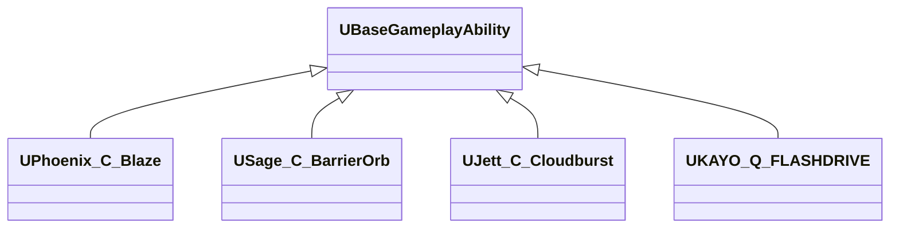

# 02. Agent Abilities (사례별)

대표 에이전트 스킬(궁극기 제외) 구현을 통해 베이스 프레임워크 적용법을 설명합니다.

범위: 4명 × C/Q/E = 총 12개 스킬(궁극기 X 제외)

## 공용화 전략: 적은 코드로 많은 스킬
- ActivationType 패턴화: 즉발형(Instant) vs 준비형(WithPrepare) 2트랙으로 분기만 다르고 나머지 수명주기는 동일.
- FollowUp 입력 통일: Waiting 단계에서 좌/우클릭만 구현하면 확정 로직이 자동 연결(ASC GameplayEvent 라우팅).
- 1P/3P 프리뷰 분리: 장착 미리보기는 1P는 로컬 비복제, 3P는 서버 생성·복제 → 지연/깜빡임 최소화.
- 투사체/지상효과 모듈: `ProjectileClass` 지정 후 `SpawnProjectile()` 호출만으로 공통 스폰/복제/이펙트 실행.
- 공통 유틸: `PlayCommonEffects`, `PlayMontages(1P/3P)`로 사운드/애니메이션 일관 처리.
- 데이터 구동: AbilityID/비용/스택 등은 데이터테이블/INI에서 읽어 UI·경제와 자연스럽게 연결.

```cpp
// 준비형 어빌리티 템플릿 요약
class UMy_Ability : public UBaseGameplayAbility {
 public:
  UMy_Ability(){ ActivationType=WithPrepare; FollowUpInputType=LeftOrRight; }
  void PrepareAbility() override { SpawnEquippedPreview(); }
  void WaitAbility() override   { if (Preview3P) Preview3P->OnEquip(); }
  bool OnLeftClickInput() override  { DestroyPreview(); ProjectileClass=LeftClass;  return SpawnProjectile(); }
  bool OnRightClickInput() override { DestroyPreview(); ProjectileClass=RightClass; return SpawnProjectile(); }
  void EndAbility(... ) override { DestroyPreview(); Super::EndAbility(...); }
};
```

## 1. 설계 목표 및 근거
- 베이스 능력(Framework)에 최소 오버라이드로 파생 스킬 구현 속도/일관성 확보
- 서버 권위 실행과 로컬 프리뷰를 분리하여 멀티플레이 체감 품질 유지
- 후속입력(좌/우클릭) 패턴을 정형화하여 UX 학습 비용 감소

## 2. 아키텍처
- 파생 클래스: Agent별 Ability 폴더 (`Abilities/<Agent>/*`)에 배치
- 공통 흐름: Prepare → Wait(프리뷰/가이드) → Execute(확정/스폰/복제)



## 3. 핵심 로직 분석
- [GitHub에서 전체 코드 보기](https://github.com/chungheonLee0325/VALORANT/blob/main/Source/Valorant/AbilitySystem/Abilities/KAYO/KAYO_Q_FLASHDRIVE.cpp)
- 좌/우클릭에 따라 던지기 방식을 분기하고, 서버 권위에서 투사체를 스폰

```cpp
bool UKAYO_Q_FLASHDRIVE::OnLeftClickInput(){ /* 직선 던지기 미리보기/확정 */ return ThrowFlashbang(false);} 
bool UKAYO_Q_FLASHDRIVE::OnRightClickInput(){ /* 포물선 던지기 미리보기/확정 */ return ThrowFlashbang(true);} 

bool UKAYO_Q_FLASHDRIVE::ThrowFlashbang(bool bAltFire){
  if (!HasAuthority(&CurrentActivationInfo) || !ProjectileClass) return false;
  // 위치/회전 계산 후 SpawnActor<AFlashbang>(ProjectileClass, ...)
  // PlayCommonEffects(ProjectileLaunchEffect, ProjectileLaunchSound, SpawnLocation);
  return true;
}
```

## 4. 구현 결과 및 문제 해결
- 로컬 1P/서버 3P 프리뷰 분리: 불필요한 복제 제거로 트랜지션 지연/깜빡임 감소
- 후속입력 타임아웃: WaitPhase에 제한시간을 두어 UX 통일 및 상태 꼬임 방지
- 에이전트별 파라미터는 데이터테이블/INI로 분리해 밸런스 조정 용이

<!-- TODO(media): Phoenix 직/곡선 벽 확정, Sage 프리뷰 회전, Jett 즉발 예시 GIF + 캡션 -->

## 5. 관련 시스템
- [01. Ability Framework](01_Ability_Framework.md)
- [03. Flash 시스템](03_Flash_System.md)
- [05. Input/HUD & ASC](05_Input_HUD_ASC.md)

## Phoenix – Blaze (C)
- 유형: `WithPrepare` + 후속입력 `LeftOrRight`
- 좌클릭: 직선 Spline Wall, 우클릭: 곡선 Spline Wall 확정
- 코드: `Source/Valorant/AbilitySystem/Abilities/Phoenix/Phoenix_C_BlazeSplineWall.cpp`

## Sage – Barrier Orb (C)
- 유형: `WithPrepare` + 후속입력 `LeftOrRight`
- Wait 단계 프리뷰/회전 → 좌클릭 설치 확정
- 코드: `Source/Valorant/AbilitySystem/Abilities/Sage/Sage_C_BarrierOrb.cpp`

## Jett – Cloudburst (C)
- 유형: `Instant` (즉발, 투사체 스폰)
- 코드: `Source/Valorant/AbilitySystem/Abilities/Jett/*` (실제 파일명에 맞춰 참조)

## KAY/O – Flashdrive (Q)
- Flash 시스템과 연동 (아래 Flash 문서 참조)
- 코드: `Source/Valorant/AbilitySystem/Abilities/KAYO/KAYO_Q_FLASHDRIVE.cpp`

## 신규 스킬 추가 가이드
1) 폴더: `Source/Valorant/AbilitySystem/Abilities/<Agent>/<AbilityName>.*`
2) 타입/후속입력 결정: ActivationType, FollowUpInputType 설정
3) Prepare/Wait/Execute 단계 로직 분리, 필요 시 투사체/그라운드 스폰
4) HUD/사운드: Waiting 안내, 실행 시 FX/SFX 멀티캐스트

<!-- TODO(media): 각 스킬별 짧은 GIF와 캡션(설치/투척/확정 흐름) 추가 -->

---

## 에이전트별 상세 목록 (구현 상태 포함)

아래는 현재 코드 기준 구현된 스킬(파일 존재 기준)입니다. 일부 궁극기는 스켈레톤(초기화/태그 배치) 상태입니다.

### Jett (궁극기 제외)

| 슬롯 | 스킬 | ActivationType | FollowUp | 핵심 동작 | 핵심 파일 | 상태 |
|---|---|---|---|---|---|---|
| C | Cloudburst | Instant | None | 연막 투사체 스폰 | `Abilities/Jett/Jett_C_Cloudburst.cpp` | 구현 |
| Q | Updraft | Instant | None | 수직 점프 부스트, 임시 중력/브레이킹 조정 | `Abilities/Jett/Jett_Q_Updraft.cpp` | 구현 |
| E | Tailwind | Instant | None | 전방 대시, 마찰/브레이킹 일시 0 | `Abilities/Jett/Jett_E_Tailwind.cpp` | 구현 |
<!-- 궁극기(X)는 상세 목록에서 제외 -->

### Phoenix (궁극기 제외)

| 슬롯 | 스킬 | ActivationType | FollowUp | 핵심 동작 | 핵심 파일 | 상태 |
|---|---|---|---|---|---|---|
| C | Blaze | WithPrepare | Left/Right | 직선/곡선 Spline Wall 확정(프리뷰→확정) | `Abilities/Phoenix/Phoenix_C_Blaze*.cpp` | 구현 |
| Q | Hot Hands | WithPrepare | Left/Right | 화염 오브 직선/포물선 투척, DOT/힐 | `Abilities/Phoenix/Phoenix_Q_HotHands.cpp` | 구현 |
| E | Curveball | WithPrepare | Left/Right | 섬광탄 좌/우 커브 투척, 1P/3P 프리뷰 | `Abilities/Phoenix/Phoenix_E_Curveball.cpp` | 구현 |
<!-- 궁극기(X)는 상세 목록에서 제외 -->

### Sage (궁극기 제외)

| 슬롯 | 스킬 | ActivationType | FollowUp | 핵심 동작 | 핵심 파일 | 상태 |
|---|---|---|---|---|---|---|
| C | Barrier Orb | WithPrepare | Left/Right | 벽 프리뷰/회전→설치 확정 | `Abilities/Sage/Sage_C_BarrierOrb.cpp` | 구현 |
| Q | Slow Orb | WithPrepare | Left | 슬로우 오브 투척, 지면 효과 | `Abilities/Sage/Sage_Q_SlowOrb.cpp` | 구현 |
| E | Healing Orb | WithPrepare | Left/Right | 아군 힐/자가 힐 선택 | `Abilities/Sage/Sage_E_HealingOrb.cpp` | 구현 |
<!-- 궁극기(X)는 상세 목록에서 제외 -->

### KAY/O (궁극기 제외)

| 슬롯 | 스킬 | ActivationType | FollowUp | 핵심 동작 | 핵심 파일 | 상태 |
|---|---|---|---|---|---|---|
| C | FRAG/ment | WithPrepare | Left/Right | 오버핸드/언더핸드 수류탄 투척 | `Abilities/KAYO/KAYO_C_FRAGMENT.cpp` | 구현 |
| Q | FLASH/drive | WithPrepare | Left/Right | 직선/포물선 플래시 투척, Flash 시스템 연동 | `Abilities/KAYO/KAYO_Q_FLASHDRIVE.cpp` | 구현 |
| E | ZERO/point | WithPrepare | Left | 억제 나이프 투척 | `Abilities/KAYO/KAYO_E_ZEROPOINT.cpp` | 구현 |
<!-- 궁극기(X)는 상세 목록에서 제외 -->
