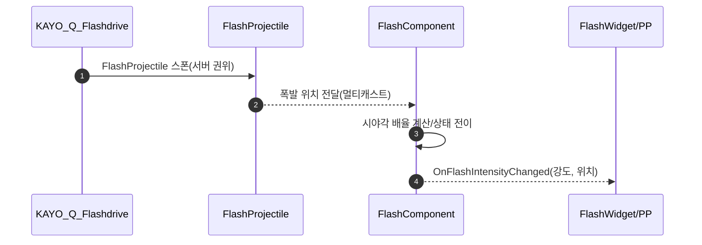

# 03. Flash 시스템

발로란트 스타일 섬광 구현: 시야각 기반 강도/지속 조절 + 빠른 회복 곡선 + UI/후처리 연동.

## 1. 설계 목표 및 근거
- 발로란트와 유사한 체감 구현: 정면 강/측면 약/후면 최소 효과, 빠른 초기 회복
- 퍼포먼스: 계산은 로컬에서, 상태 복제는 최소화하여 네트워크 비용 절감
- 확장성: 파라미터(각도/배율/최소치)로 맵/메타에 맞게 손쉽게 튜닝

## 2. 아키텍처
- `UFlashComponent`가 상태/강도/타이머를 관리, 어빌리티/투사체가 트리거
- 델리게이트 `OnFlashIntensityChanged`로 UI/후처리(위젯/PP) 업데이트

## 핵심 파일
- 코어: `Source/Valorant/Player/Component/FlashComponent.*`
- 어빌리티: `Source/Valorant/AbilitySystem/Abilities/KAYO/KAYO_Q_FLASHDRIVE.cpp`
- 투사체: `Source/Valorant/AgentAbility/FlashProjectile.cpp`
- UI/후처리: `Source/Valorant/UI/FlashWidget.cpp`, `Source/Valorant/Player/Component/FlashPostProcessComponent.cpp`

## 3. 핵심 로직 분석
- [GitHub에서 전체 코드 보기](https://github.com/chungheonLee0325/VALORANT/blob/main/Source/Valorant/Player/Component/FlashComponent.cpp)
- 시야각 배율과 회복 곡선

```cpp
float UFlashComponent::CalculateViewAngleMultiplier(FVector InFlashLocation){
  // 카메라 Forward vs 섬광 방향 각도 → 구간별 배율(Front/Side/Peripheral)
  // 임계각 초과 시 0.0(최소 효과 경로)
}

void UFlashComponent::UpdateFlashEffect(){
  // CompleteBlind: 1.0 유지 → Recovery: intensity = pow(1 - t, 2.0)
  OnFlashIntensityChanged.Broadcast(CurrentFlashIntensity, FlashLocation);
}
```

## 4. 구현 결과 및 문제 해결
- 각도 임계치 설정: 후면에서도 0이 아닌 ‘최소 효과’ 경로를 추가해 체감 개선
- 1P/3P 처리: 1P는 로컬 표시, 서버는 3P 동기화로 네트워크 비용 최소화
- HUD/후처리: 델리게이트로 단방향 갱신, 틱 활성화/비활성화로 불필요 연산 방지

<!-- TODO(media): Flash_Angle_Demo.gif / Flash_RecoveryCurve.gif Git URL + 캡션 -->

## 5. 관련 시스템
- [02. Agent Abilities](02_Agent_Abilities.md)
- [01. Ability Framework](01_Ability_Framework.md)
- [05. Input/HUD & ASC](05_Input_HUD_ASC.md)

## 동작 개요
- 상태: `EFlashState { None → CompleteBlind → Recovery }`
- 시야각: 정면(1.0)·측면(0.7)·주변시(0.4)·임계각 초과 시 최소 효과(0.2s/0.8)
- 회복: `CurrentFlashIntensity = pow(1 - t, 2.0)` 초기 급감
- 이벤트: `OnFlashIntensityChanged(float Intensity, FVector Source)` 브로드캐스트



## API 요약 (FlashComponent)
- `CheckViewAngleAndApplyFlash(Location, Blind, Recovery, Type)`
- `FlashEffect(Blind, Recovery, AngleMultiplier, Type, Location)`
- `CalculateViewAngleMultiplier(Location)`
- `OnFlashIntensityChanged` 델리게이트로 UI/후처리 업데이트

## 튜닝 포인트
- `FrontViewAngle/SideViewAngle`, `ViewAngleThreshold`
- `FrontViewMultiplier/SideViewMultiplier/PeripheralViewMultiplier`
- `MinimumFlashDuration/MinimumFlashIntensity`

<!-- TODO(media): 각도별 강도 비교/회복 곡선 GIF와 캡션 추가 -->
