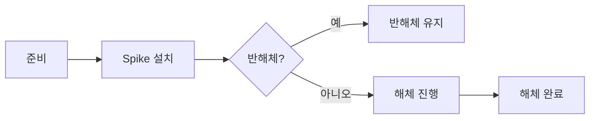

# 04. Spike 시스템

Spike 설치/반해체/해체 상태머신과 네트워크 동기화를 설명합니다.


https://github.com/user-attachments/assets/40a0393d-b7aa-49bb-903c-98b432945c84


## 1. 설계 목표 및 근거
- 서버 권위의 진행률/상태 관리로 공정성·치팅 방지
- 반해제(half-defuse)와 상태 복제를 통해 관전자/상대에게도 동일 피드백 제공
- 입력 취소/사망 등 예외 처리로 상태 꼬임 방지

## 핵심 파일
- `Source/Valorant/ValorantObject/Spike/Spike.cpp`
- 상호작용 베이스: `Source/Valorant/ValorantObject/BaseInteractor.*`

## 2. 아키텍처 / 상태와 흐름
- 설치(Plant) → 반해체(Partial) → 해체(Defuse)
- 서버 권위로 진행, 진행률/상태 복제
- HUD/사운드: 상태 전환 및 임계 시점 안내



## 3. 핵심 로직 분석
- [GitHub에서 전체 코드 보기](https://github.com/chungheonLee0325/VALORANT/blob/main/Source/Valorant/ValorantObject/Spike/Spike.cpp)
- Tick에서 설치/해제 진행, 타임아웃/사망/반해체 임계 처리

```cpp
if (HasAuthority()){
  if (SpikeState==ESpikeState::Planting && InteractingAgent){
    if (InteractingAgent->IsDead()) { ServerRPC_CancelPlanting(); }
    InteractProgress += DeltaTime; MulticastRPC_Progress(InteractProgress, PlantTime);
    if (InteractProgress >= PlantTime) { ServerRPC_FinishPlanting(); }
  } else if (SpikeState==ESpikeState::Defusing && InteractingAgent){
    if (InteractingAgent->IsDead()) { ServerRPC_CancelDefusing(); }
    InteractProgress += DeltaTime; MulticastRPC_Progress(InteractProgress, DefuseTime);
    if (!bIsHalfDefused && InteractProgress >= HalfDefuseTime) { CheckHalfDefuse(); }
    if (InteractProgress >= DefuseTime) { ServerRPC_FinishDefusing(); }
  }
}
```

## 4. 구현 결과 및 문제 해결
- 반해체 로직: Half 시점 표시/보존 처리로 재진입 시 효율 유지
- 복제 최적화: 진행률/상태만 복제하고 기타 이펙트는 멀티캐스트로 처리
- 인터랙션 예외 처리: 죽음/이탈 시 서버에서 즉시 취소하여 꼬임 방지

<!-- TODO(media): 설치/해체 UI 진행도/반해체 임계 데모 GIF + 캡션 -->

## 5. 관련 시스템
- [05. Input/HUD & ASC](05_Input_HUD_ASC.md)
- [06. Shop & Economy](06_Shop_Economy.md)
- [01. Ability Framework](01_Ability_Framework.md)

## 구현 포인트
- 상호작용 입력 → 서버 검증 → 진행률 업데이트 → 멀티캐스트 알림
- 라운드/게임 상태와의 연동 고려(무효 시점 차단)

<!-- TODO(media): 설치/해체 진행도 UI와 동기화 데모 GIF + 캡션 추가 -->
