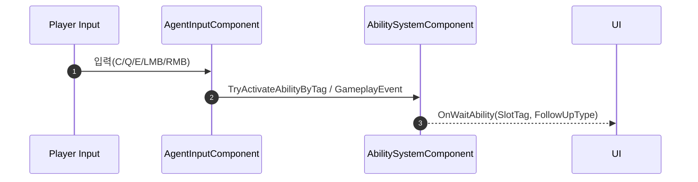

# 05. Input/HUD & ASC 연동

입력 라우팅, Waiting 단계 HUD 안내, ASC 이벤트 전달 방식을 설명합니다.

## 1. 설계 목표 및 근거
- 입력→ASC→Ability 라우팅을 표준화하여 버그 포인트 축소
- Waiting 단계에서 무기/스킬 입력 하이재킹을 명확히 안내해 UX 강화
- HUD는 단방향 이벤트 수신(OnWaitAbility/FollowUp)으로 단순 유지

## 핵심 파일
- 입력: `Source/Valorant/Player/Component/AgentInputComponent.*`
- ASC 확장: `Source/Valorant/AbilitySystem/AgentAbilitySystemComponent.*`
- HUD: `Source/Valorant/UI/*`

## 2. 아키텍처 / 라우팅 개요
- C/Q/E/LMB/RMB → `AgentInputComponent`
- 활성 어빌리티가 Waiting 상태면 `GameplayEvent`로 후속입력 전달
- 일반 활성화는 `TryActivateAbilitiesByTag` 경로로 서버 권위 실행



## 3. 핵심 로직 분석
- [GitHub에서 전체 코드 보기](https://github.com/chungheonLee0325/VALORANT/blob/main/Source/Valorant/Player/Component/AgentInputComponent.cpp)
- 좌클릭 입력 처리: 상점 열림/사망 예외 → ASC로 태그 활성화 → 실패 시 무기 발사

```cpp
void UAgentInputComponent::StartFire(const FInputActionValue&){
  if (PC->ShopUI) return; if (Agent->IsDead()) return;
  if (UAgentAbilitySystemComponent* ASC = Agent->GetASC()){
    if (!ASC->TryActivateAbilityByTag(LeftClickTag)) { Agent->StartFire(); }
  }
}
```

## 4. HUD 가이드
- Waiting 진입 시: 좌/우클릭 안내, 후속입력 타임아웃 표시
- 실행 시: 성공/실패/쿨다운 등 즉시 피드백

<!-- TODO(media): Waiting 안내 UI와 FollowUp 입력 예시 GIF + 캡션 추가 -->

## 5. 관련 시스템
- [01. Ability Framework](01_Ability_Framework.md)
- [02. Agent Abilities](02_Agent_Abilities.md)
- [03. Flash 시스템](03_Flash_System.md)
