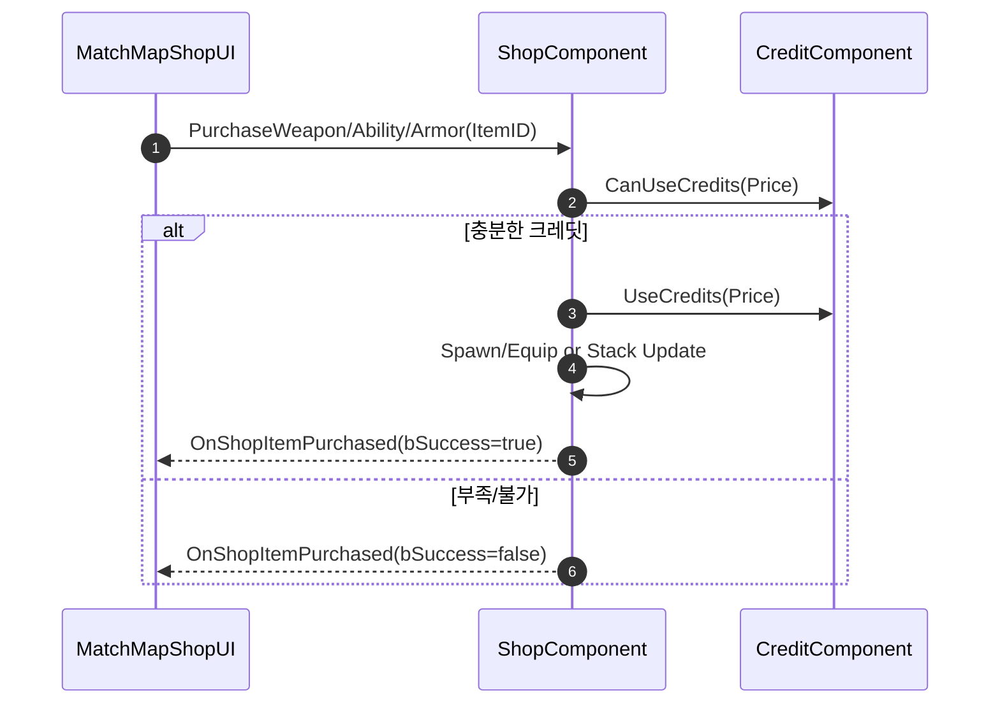

# 06. Shop & Economy

서버 검증 기반 상점(무기/어빌리티/방어구)과 라운드 경제(크레딧) 시스템을 설명합니다.

## 1. 설계 목표 및 근거
- 서버 권위 결제: 크레딧 차감/환불/장착을 서버에서 처리해 중복/치팅 방지
- 명확한 환불 규칙: 동일 카테고리 교체 시 미사용 무기 환불(부분/전액) 지원
- UI 동기화: 결과 디스패처/리플리케이션으로 일관된 피드백 제공

## 핵심 파일
- 상점 로직: `Source/Valorant/Player/Component/ShopComponent.*`
- UI: `Source/Valorant/UI/MatchMap/MatchMapShopUI.*`
- 크레딧: `Source/Valorant/Player/Component/CreditComponent.*`

## 2. 아키텍처 / 상점 개요
- 라운드/프리페이즈에만 활성화(IsShopAvailable)
- 아이템 타입: `EShopItemType { Weapon, Ability, Armor }`
- 아이템 구조: `FShopItem { ItemID, ItemName, ItemType, Price, Icon, ItemClass, bIsAvailable }`
- 이벤트: `OnShopItemPurchased`, `OnShopAvailabilityChanged`, `OnEquippedWeaponsChanged`

## 3. 핵심 로직 분석 (구매 흐름)


- [GitHub에서 전체 코드 보기(ShopComponent)](https://github.com/chungheonLee0325/VALORANT/blob/main/Source/Valorant/Player/Component/ShopComponent.cpp)
- 구매 가능/환불/차감 핵심

```cpp
bool UShopComponent::CanPurchaseItem(int32 ItemID, EShopItemType ItemType, int32& OutRefund){
  // 무기: 기존 장착 무기/카테고리 확인 → 환불 계산 → 최종 비용 산출
  // 어빌리티/방어구: 가격/보유 상태 확인
  return CreditComp->CanUseCredits(Cost - OutRefund);
}
bool UShopComponent::PurchaseWeapon(int32 WeaponID){
  // CanPurchaseItem → 환불 AddCredits → UseCredits → SpawnWeaponForPlayer
}
```

## 4. 구현 결과 및 문제 해결 / UI 연동
- `UMatchMapShopUI`에서 카테고리별 리스트/하이라이트/가격/스택 표시
- 구매 결과: `OnPurchaseResult(bSuccess, ItemID, ItemType)` 디스패처
- 어빌리티 스택: `GetAbilityStack/MaxAbilityStack`, `OnAbilityStackChanged` 이벤트로 UI 갱신

문제 해결 사례
- 중복 구매/중복 장착: 서버에서 카테고리별 장착 상태 검사, 미사용 무기 제거/환불 처리
- 크레딧 레이스 컨디션: 서버 권위 UseCredits, 클라이언트는 UI만 갱신(온리플)
- 라운드 상태: `IsShopAvailable()`로 비구매 시점 차단

## 5. 경제 규칙(크레딧)
- 컴포넌트: `UCreditComponent` (복제/온리플로 UI 동기화)
- API: `AddCredits`, `UseCredits`, `CanUseCredits`, `ResetForNewRound`
- 보상: `AwardRoundEndCredits(bIsWinner, ConsecutiveLosses)`, `AwardKillCredits()`, `AwardSpikeActionCredits(bIsPlant)`
- 상한: `MaxCredit` 유지, INI/데이터테이블로 상수 튜닝 가능

## 데이터/튜닝 포인트
- 가격/스택/제약은 데이터테이블/INI로 관리(프로젝트 정책에 맞게)
- UI 아이콘/텍스트/색상: `MatchMapShopUI` BindWidget와 Blueprint 이벤트로 커스터마이즈

## 테스트 팁
- 프리페이즈에서 상점 활성화 확인 → 기본/부족 크레딧 케이스로 구매 시도
- 팀 전환/라운드 종료에서 `AwardRoundEndCredits`/`ResetForNewRound` 검증

<!-- TODO(media): Shop_Buy_Validate.gif, Ability_Stack_Buy.gif 캡션 포함 추가 -->

## 관련 시스템 (Related)
- [05. Input/HUD & ASC](05_Input_HUD_ASC.md)
- [04. Spike 시스템](04_Spike_System.md)
- [01. Ability Framework](01_Ability_Framework.md)
